# ESP32 Bus Pirate

**ESP32 Bus Pirate** is an open-source firmware that turns your device into a multi-protocol hacker's tool, inspired by the [legendary Bus Pirate](https://buspirate.com/).

It supports sniffing, sending, scripting, and interacting with various digital protocols (I2C, UART, 1-Wire, SPI, etc.) via a serial terminal or web-based CLI.

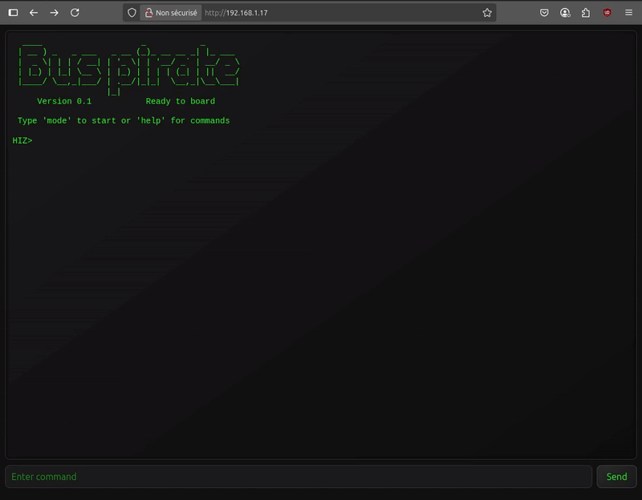

## Features

- Interactive command-line interface (CLI) via **USB Serial or WiFi Web**.
- **Modes for:**
  - HiZ (default)
  - I2C (scan, glitch, slave mode, dump)
  - SPI (flash, sdcard, slave mode)
  - UART / Half-Duplex UART (bridge, read, write)
  - 1-WIRE (ibutton, temp sensor)
  - 2WIRE (smartcard) / 3WIRE (eeprom)
  - DIO (Digital I/O, read, pullup, set)
  - Infrared (device-b-gone, send and receive)
  - USB (HID, mouse, keyboard, gamepad, storage)
  - Bluetooth (BLE HID, scan, spoofing, sniffing)
  - Wi-Fi (scan, AP, connect, sniff, deauth)
  - JTAG (scan pinout, SWD)
  - LED control (animations, set LEDs)
  - I2S
  - CAN

- **Protocol sniffers** for I2C, Wi-Fi, Bluetooth, 1Wire, CAN.
- Baudrate **auto-detection** and various tools for UART.
- Registers manipulation, dump tools for I2C.
- Scripting using **Bus Pirate-style bytecode** instructions.
- Device-B-Gone command with more than 80 supported INFRARED protocols.
- Direct I/O management, PWM, pin state.
- Massive adressable LEDs protocol support.
- Web interface with **live terminal**, or a classic **serial CLI**.

## Supported Devices

- **ESP32 S3 Dev Kit**

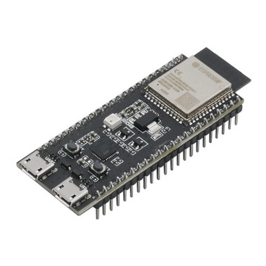

- **M5 Cardputer**


- **M5 Stick C Plus 2**

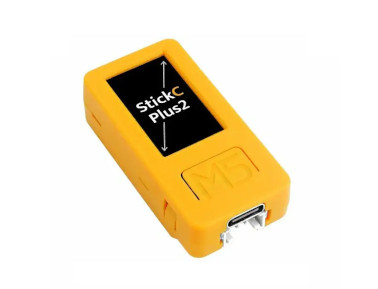

- **M5 Atom S3 Lite**

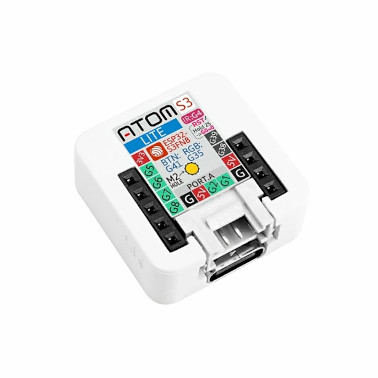

- **M5 Stamp S3**

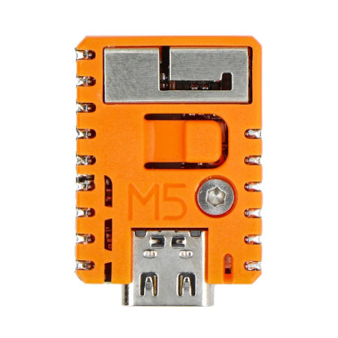

- **LILYGO T-Embed**

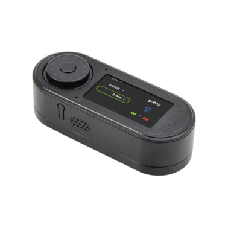

- **LILYGO T-Embed CC1101**

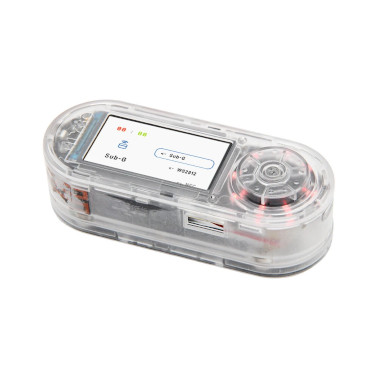


## Wiki

📚 Visit the **[Wiki](https://github.com/geo-tp/ESP32-Bus-Pirate/wiki)** for detailed documentation on every mode and command.

Includes:
- [Terminal mode](https://github.com/geo-tp/ESP32-Bus-Pirate/wiki/00-Terminal) - About serial and web terminal.
- [Mode overviews](https://github.com/geo-tp/ESP32-Bus-Pirate/wiki) - Browse supported modes.
- [Instruction syntax](https://github.com/geo-tp/ESP32-Bus-Pirate/wiki/99-Instructions) - Master the instructions.
- [Serial setup](https://github.com/geo-tp/ESP32-Bus-Pirate/wiki/99-Serial) - Serial access via USB.
- [Python scripting examples](https://github.com/geo-tp/ESP32-Bus-Pirate/wiki/99-Python) - Automate tasks using Python.


The wiki is the best place to learn how everything works.

## Getting Started

1. 🔧 Flash the firmware  
   - Download the latest release from the [Releases](https://github.com/geo-tp/ESP32-Bus-Pirate/releases) page, and flash it using your favorite tool (`esptool.py`, `PlatformIO`, etc.).
   - You can also burn it on [M5Burner](https://docs.m5stack.com/en/download), in the M5stick, AtomS3, M5StampS3 or Cardputer category.

2. 🔌 Connect via Serial or Web
   - Serial: any terminal app (see [Connect via Serial](https://github.com/geo-tp/ESP32-Bus-Pirate/wiki/99-Serial))
   - Web: configure Wi-Fi and access the CLI via browser

3. 🧪 Use commands like:
   ```bash
   mode
   help
   scan
   sniff
   ...
    ```
   See detailed explanations about [Terminal Commands](https://github.com/geo-tp/ESP32-Bus-Pirate/wiki) and how each one works.
   
## ESP32 Bus Pirate on M5 Devices
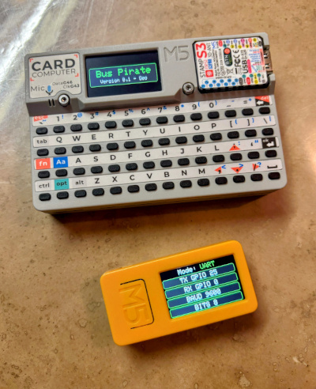

## ESP32 Bus Pirate on T-Embed
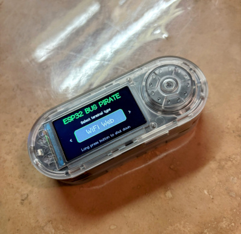

## Web & Serial Interfaces

The ESP32 Bus Pirate firmware provides two command-line interface (CLI) modes:

| Interface         | Advantages                                                                 | Ideal for...                          |
|------------------|-----------------------------------------------------------------------------|----------------------------------------|
| **Web Interface** | - Accessible from any browser<br>- Works over Wi-Fi<br>- No cables needed | Quick tests, demos, headless setups   |
| **Serial Interface** | - Faster performance<br>- Instant responsiveness<br>- Handles large data smoothly | Intensive sessions, frequent interactions |


Both interfaces share the same command structure and can be used interchangeably.

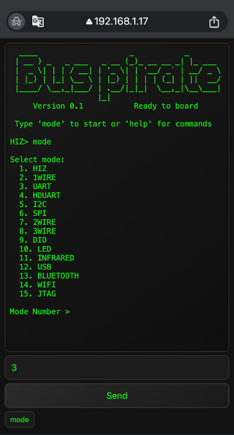

## Using the ESP32 Bus Pirate to speak UART over WiFi
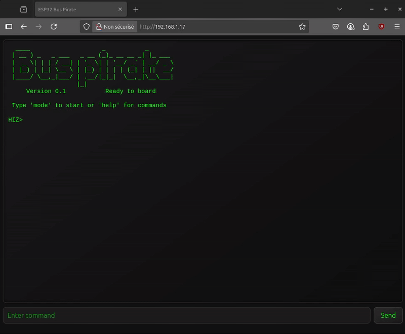

## Contribute
See [How To Contribute](https://github.com/geo-tp/ESP32-Bus-Pirate/wiki/99-Contribute) section, which outlines a simple way to add a new command to any mode.

## Warning
> ⚠️ **Voltage Warning**: Devices should only operate at **3.3V** or **5V**.  
> Do **not** connect peripherals using other voltage levels — doing so may **damage your ESP32**.
